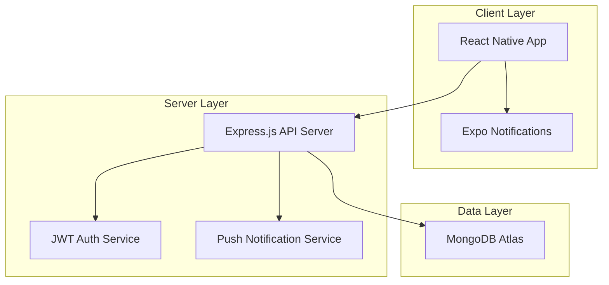

# Design Document

## Overview

The College Event Management App is a React Native mobile application with an Express.js backend and MongoDB database. The system implements role-based access control with three user types: Students, Club Heads, and Council Members (PR/OC). The architecture follows a client-server model with JWT-based authentication, real-time notifications, and a calendar-centric user interface.

## Architecture

### High-Level Architecture



### Technology Stack

- **Frontend**: React Native with Expo SDK
- **Backend**: Node.js with Express.js
- **Database**: MongoDB Atlas with Mongoose ODM
- **Authentication**: JWT with role-based middleware
- **Push Notifications**: Expo Notifications
- **State Management**: React Context API with useReducer
- **Navigation**: React Navigation v6
- **HTTP Client**: Axios with interceptors
- **Deployment**: Vercel (frontend), Render (backend)

## Components and Interfaces

### Frontend Components

#### Authentication Components
- `LoginScreen`: Main login interface with student/council toggle
- `StudentLoginForm`: Name, roll number, password inputs
- `CouncilLoginForm`: Club name, password inputs
- `ForgotPasswordScreen`: Password reset functionality
- `PasswordChangeModal`: Forced password change for council first login

#### Main Application Components
- `MainTabNavigator`: Bottom tab navigation
- `EventCalendar`: Primary calendar interface using react-native-calendars
- `EventDetailsModal`: Event information display and registration
- `UserProfile`: User info display (name, roll number)

#### Event Management Components
- `EventCreationModal`: Club heads create events
- `EventEditModal`: PR members edit any event
- `EventRegistrationList`: View registered participants

#### Club Management Components
- `ClubList`: Available clubs for joining
- `MyClubsList`: Display all clubs student is enrolled in
- `ClubJoinRequest`: Send join requests
- `ClubMembershipManager`: Club heads manage requests
- `ClubBroadcastChannel`: Club-specific messaging
- `ClubSelector`: Switch between different club channels

#### Communication Components
- `NoticeBoardScreen`: College-wide announcements
- `BroadcastChannel`: Real-time messaging interface
- `NavigationButtons`: Notice board, your club, college events

### Backend API Endpoints

#### Authentication Routes
```
POST /api/auth/student-login
POST /api/auth/council-login
POST /api/auth/forgot-password
POST /api/auth/reset-password
POST /api/auth/change-password
GET /api/auth/verify-token
```

#### User Management Routes
```
GET /api/users/profile
PUT /api/users/profile
GET /api/users/students
GET /api/users/council-members
```

#### Event Management Routes
```
GET /api/events
POST /api/events
PUT /api/events/:id
DELETE /api/events/:id
POST /api/events/:id/register
GET /api/events/:id/registrations
```

#### Club Management Routes
```
GET /api/clubs
POST /api/clubs/:id/join-request
GET /api/clubs/:id/members
PUT /api/clubs/:id/membership/:userId
GET /api/clubs/my-clubs
POST /api/clubs/:id/leave
GET /api/clubs/:id/broadcasts
```

#### Communication Routes
```
GET /api/broadcasts/college
POST /api/broadcasts/college
GET /api/broadcasts/club/:clubId
POST /api/broadcasts/club/:clubId
```

## Data Models

### User Schema
```javascript
{
  _id: ObjectId,
  name: String,
  rollNumber: String, // For students
  clubName: String,   // For council members
  password: String,   // Hashed
  role: String,       // 'student', 'club_head', 'pr', 'oc'
  isFirstLogin: Boolean,
  enrolledClubs: [{   // Multiple clubs for students
    clubId: ObjectId,
    joinedDate: Date,
    status: String    // 'active', 'inactive'
  }],
  createdAt: Date,
  lastActive: Date,
  activeSessions: [{
    token: String,
    loginTime: Date,
    deviceInfo: String
  }]
}
```

### Event Schema
```javascript
{
  _id: ObjectId,
  title: String,
  description: String,
  clubId: ObjectId,
  clubName: String,
  date: Date,
  startTime: String,
  endTime: String,
  venue: String,
  createdBy: ObjectId,
  registrations: [ObjectId],
  maxParticipants: Number,
  status: String, // 'active', 'cancelled'
  createdAt: Date,
  updatedAt: Date
}
```

### Club Schema
```javascript
{
  _id: ObjectId,
  name: String,
  description: String,
  clubHead: ObjectId,
  members: [ObjectId],
  pendingRequests: [{
    userId: ObjectId,
    requestDate: Date,
    status: String // 'pending', 'approved', 'rejected'
  }],
  createdAt: Date
}
```

### Broadcast Schema
```javascript
{
  _id: ObjectId,
  message: String,
  sender: ObjectId,
  senderName: String,
  type: String, // 'college', 'club'
  clubId: ObjectId, // null for college broadcasts
  timestamp: Date,
  isUrgent: Boolean
}
```

## Error Handling

### Frontend Error Handling
- **Network Errors**: Retry mechanism with exponential backoff
- **Authentication Errors**: Automatic token refresh, redirect to login
- **Validation Errors**: Real-time form validation with user-friendly messages
- **Session Expiry**: Graceful logout with session restoration option

### Backend Error Handling
- **Validation Middleware**: Joi schema validation for all inputs
- **Authentication Middleware**: JWT verification with role checking
- **Error Response Format**:
```javascript
{
  success: false,
  error: {
    code: 'VALIDATION_ERROR',
    message: 'User-friendly error message',
    details: {} // Additional error context
  }
}
```

### Database Error Handling
- **Connection Errors**: Automatic reconnection with circuit breaker pattern
- **Duplicate Key Errors**: Meaningful error messages for unique constraints
- **Transaction Rollback**: For multi-document operations

## Security Considerations

### Authentication Security
- **Password Hashing**: bcrypt with salt rounds of 12
- **JWT Security**: 
  - Access tokens: 1.5 month expiry
  - Secure HTTP-only cookies for web (if applicable)
  - Token blacklisting for logout
- **Session Management**: 
  - Maximum 2 concurrent sessions per council account
  - Session tracking with device fingerprinting
  - Automatic logout after 2 months inactivity

### API Security
- **Rate Limiting**: Express-rate-limit middleware
- **Input Sanitization**: Mongoose schema validation + express-validator
- **CORS Configuration**: Restricted to allowed origins
- **Helmet.js**: Security headers

### Data Protection
- **Sensitive Data**: No plain text passwords stored
- **Role-based Access**: Middleware checks for all protected routes
- **Data Validation**: Server-side validation for all inputs

## Testing Strategy

### Frontend Testing
- **Unit Tests**: Jest + React Native Testing Library
  - Component rendering tests
  - User interaction tests
  - Navigation flow tests
- **Integration Tests**: API integration with mock backend
- **E2E Tests**: Detox for critical user flows

### Backend Testing
- **Unit Tests**: Jest + Supertest
  - Route handler tests
  - Middleware tests
  - Utility function tests
- **Integration Tests**: Database operations with test database
- **API Tests**: Complete request/response cycle testing

### Test Coverage Goals
- **Frontend**: 80% code coverage
- **Backend**: 90% code coverage
- **Critical Paths**: 100% coverage (authentication, event creation, club management)

## Performance Considerations

### Frontend Performance
- **Code Splitting**: Lazy loading for non-critical screens
- **Image Optimization**: Compressed images with caching
- **List Virtualization**: FlatList for large data sets (club lists, member lists)
- **Multi-club Navigation**: Efficient switching between club channels
- **State Management**: Optimized re-renders with React.memo

### Backend Performance
- **Database Indexing**: 
  - Compound index on (date, clubId) for events
  - Index on rollNumber for student lookups
  - Index on clubName for council lookups
  - Index on enrolledClubs.clubId for multi-club membership queries
- **Caching Strategy**: Redis for frequently accessed data
- **Query Optimization**: Aggregation pipelines for multi-club membership queries

### Real-time Features
- **Push Notifications**: Batch notifications to reduce server load
- **WebSocket Alternative**: Server-sent events for real-time updates
- **Offline Support**: AsyncStorage for critical data caching

## Deployment Architecture

### Frontend Deployment (Vercel)
- **Build Process**: Expo build with environment-specific configs
- **Environment Variables**: Separate configs for dev/staging/prod
- **CDN**: Automatic asset optimization and global distribution

### Backend Deployment (Render)
- **Container**: Docker container with Node.js runtime
- **Environment**: Production MongoDB Atlas connection
- **Health Checks**: /health endpoint for monitoring
- **Scaling**: Horizontal scaling based on CPU/memory usage

### Database (MongoDB Atlas)
- **Cluster**: Shared cluster for development, dedicated for production
- **Backup**: Automated daily backups with point-in-time recovery
- **Monitoring**: Atlas monitoring with alerting

## Development Timeline (35 Days)

### Phase 1: Foundation (Days 1-10)
- Backend API setup with authentication
- Database models and basic CRUD operations
- Frontend project setup with navigation

### Phase 2: Core Features (Days 11-25)
- Event calendar implementation
- Club management system
- User authentication flows

### Phase 3: Communication & Polish (Days 26-35)
- Broadcast messaging system
- Push notifications
- Testing, bug fixes, and deployment